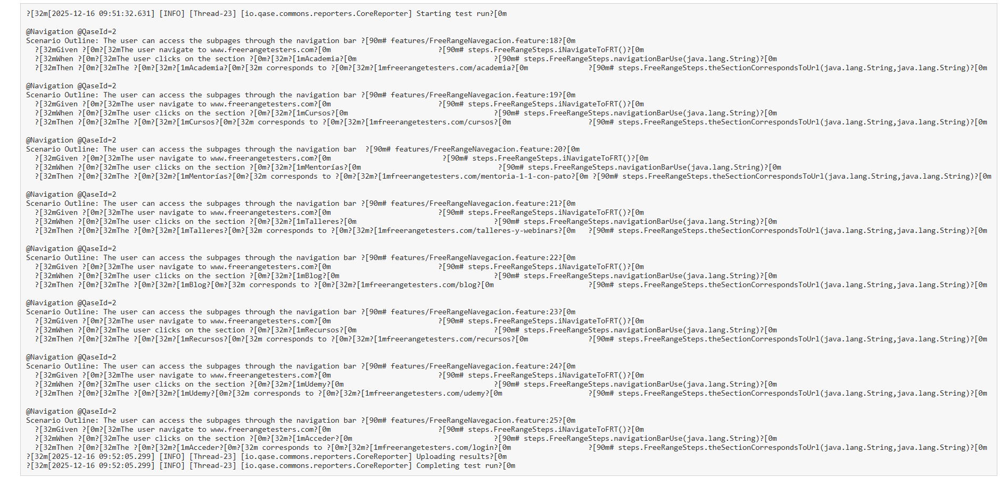

# Java Selenium Automation Project - QA Project.-Free Range Testers

## 🚀 Key Achievements and Framework Architecture

This project establishes a robust End-to-End (E2E) testing framework with a Continuous Integration (CI/CD) focus, demonstrating the capability to automate, execute, and report results in cloud environments.

---

## 1. Technology Stack

| Component | Technology | Purpose |
| :--- | :--- | :--- |
| **Language** | Java 21 | Core of the Automation Framework. |
| **Testing** | Cucumber (BDD) & JUnit 5 | Implementation of business-readable scenarios. |
| **Web Automation** | Selenium WebDriver | Interaction with the browser and UI elements. |
| **Build Tool** | Gradle | Dependency management and build tasks. |
| **Test Management** | Qase.io (TestOps) | Centralized reporting and manual/auto traceability. |

---

## 2. Continuous Integration (CI/CD) Pipeline

A complete workflow was implemented in **GitHub Actions** to guarantee quality with every code push.

* **Autonomous Execution:** Tests run automatically on a Linux runner, utilizing **Headless mode** to optimize performance and stability in the cloud.
* **Barrier Resolution:** Solved complex environment configuration challenges, including managing `JAVA_HOME` settings and correctly assigning execution permissions on the server (`chmod +x gradlew`).

### 2.1. Pipeline Status

The following screenshots demonstrates the successful completion of the job, confirming the correct configuration of environment variables, Gradle execution, and artifact upload.


---

## 3. TestOps Integration and Traceability

A communication bridge was established between the test code and the test management platform.

* **Qase API Synchronization:** The Qase plugin was configured to upload execution results directly to the TestOps platform via its API.
  
### 3.1. Reporting Evidence (CI/CD Log)

I established a communication bridge between the automated suite and **Qase API** to ensure 100% traceability.

* **Real-time Reporting:** Execution results are automatically uploaded to the TestOps platform.
* **API Synchronization:** Confirmed via CI/CD logs:
    ```bash
    [io.qase.commons.reporters.CoreReporter] Starting test run
    [io.qase.commons.reporters.CoreReporter] Uploading results
    [io.qase.commons.reporters.CoreReporter] Completing test run
    ```
* **Visual Confirmation:**
    

  ---

## 4. 📈 Execution Results and BDD Traceability

The framework follows a **Behavior Driven Development (BDD)** approach, ensuring that test cases are readable by both technical and non-technical stakeholders.

### 💡 Implementation Highlights
* **Data Driven Testing (DDT):** Utilized Cucumber *Scenario Outlines* to execute the same business flow with multiple data sets, maximizing coverage with minimal code.
* **Traceability:** Every scenario is mapped to specific Test Case IDs (e.g., `@QaseId=2`) to maintain a clear link between requirements and automation.

### 🔍 HTML Report Validation
The Cucumber/Gradle report confirms that all mapped test cases passed successfully, validating the end-to-end user flows.



---

## 📬 Contact
**María Ángeles Cortés ** - [https://www.linkedin.com/in/mariangelescortes/)]
*ISTQB® Certified Tester Foundation Level*


    
